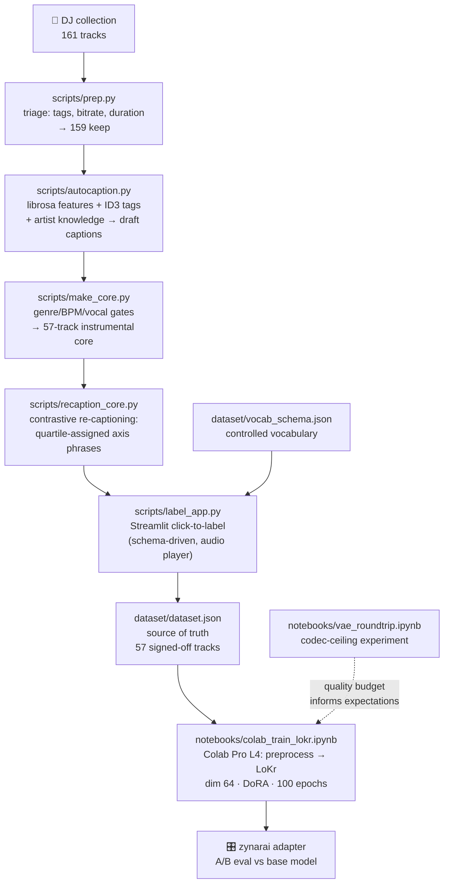

# electronic-lora

Training a genre LoRA (LoKr) for [ACE-Step 1.5](https://github.com/ace-step/ACE-Step-1.5)
on a 57-track instrumental house / tech-house core, curated and expert-labeled from a
personal DJ collection. **v1** is a private pipeline shakedown on commercial tracks
(audio intentionally untracked — see [Rights](#rights--provenance)); **v2** will be a
publishable model trained on original productions (artist: Zynar).

Trigger word: `zynarai` — prepended to every training caption, invoked at inference.

## Pipeline



## The idea: captions are coordinates

Training captions assign each track coordinates in the model's conditioning space.
The design rules that follow (full notes in
[`notes/captions-as-coordinates.md`](notes/captions-as-coordinates.md)):

- **Constants belong to the trigger word** — a phrase on ~every track teaches nothing;
  `zynarai` absorbs what the whole set shares.
- **Descriptors carry only within-dataset variance** — measured axes (dynamics,
  brightness, percussion density, low-end weight) label only the top/bottom quartile;
  the middle stays silent.
- **Separation proportional to audible difference** — a false or diluted descriptor
  bends the axis for every track that uses it.
- **One concept, one exact phrase** — the controlled vocabulary
  ([`dataset/VOCABULARY.md`](dataset/VOCABULARY.md), machine form:
  [`dataset/vocab_schema.json`](dataset/vocab_schema.json)) is enforced by the
  labeling app.

## Repo layout

```
scripts/
  prep.py                collection triage → triage_report.csv + draft dataset
  autocaption.py         librosa + tags + artist-style → draft captions
  make_core.py           v1 core subset (genre/BPM/vocal gates)
  recaption_core.py      quartile-contrastive caption rewrite
  label_app.py           Streamlit labeler (schema-driven, reusable)
  make_review_sheet.py   xlsx worksheet generator (spreadsheet workflow)
  apply_review.py        sync sheet edits back to dataset.json
  serve_audio.py         localhost audio server (range requests)
dataset/
  dataset.json           training source of truth (57 samples, ACE-Step format)
  vocab_schema.json      caption vocabulary as machine-readable schema
  VOCABULARY.md          the human version: rules, rubrics, change log
  *.csv, dataset.*.json  provenance trail (triage → draft → core)
  audio/                 untracked — hardlinks to local files
notebooks/
  vae_roundtrip.ipynb    measure the Oobleck VAE codec ceiling on real tracks
  colab_train_lokr.ipynb Colab Pro training run (disconnect-safe via Drive)
notes/
  captions-as-coordinates.md   design notes / blog draft
PLAN.md                  living plan + decision log
```

## Usage

```bash
uv venv --python 3.12 && source .venv/bin/activate
uv pip install librosa soundfile mutagen openpyxl streamlit torch torchaudio diffusers matplotlib jupyterlab

# label (click-to-label UI with audio player)
streamlit run scripts/label_app.py

# measure the codec ceiling
jupyter lab notebooks/vae_roundtrip.ipynb

# train: upload dataset/ to Drive, open notebooks/colab_train_lokr.ipynb in Colab Pro (L4)
```

## Findings so far

- **Codec ceiling** (VAE round-trip on real masters): ~−7 dB time-domain null /
  ~−13 dB magnitude-spectral error at the 25 Hz Oobleck latent; nulls are dominated
  by stereo/phase info. Reconstructions are adequate — generation badness is mostly
  sampler/prior, which a LoRA *can* address.
- **Labeling tools shape labels**: a truth-affirmation UI (click every pill that's
  true) re-diluted the vocabulary that quartile discipline had fixed
  (`clean modern club mix` → 52/57). Shipped as-is for v1; v2 labeler gets per-pill
  frequency counters. Contrast must be enforced by the interface, not labeler discipline.

## Rights & provenance

v1 trains on commercially released tracks from a personal collection — a **private
training experiment**; audio is never committed and the adapter will not be published.
The publishable model (v2) will train exclusively on original Zynar productions and
stems with full chain of title. The `.gitignore` enforces the audio boundary.
